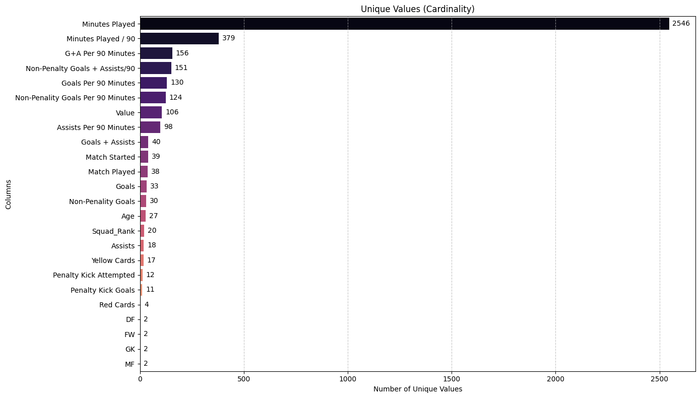
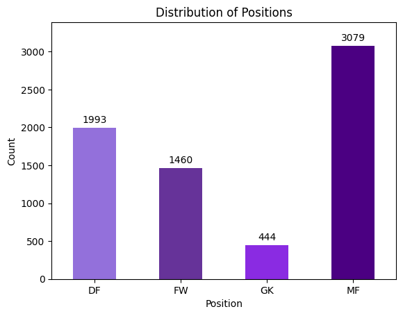
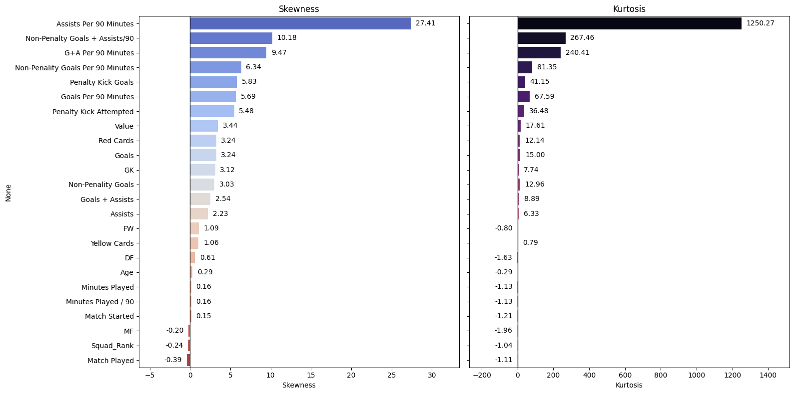
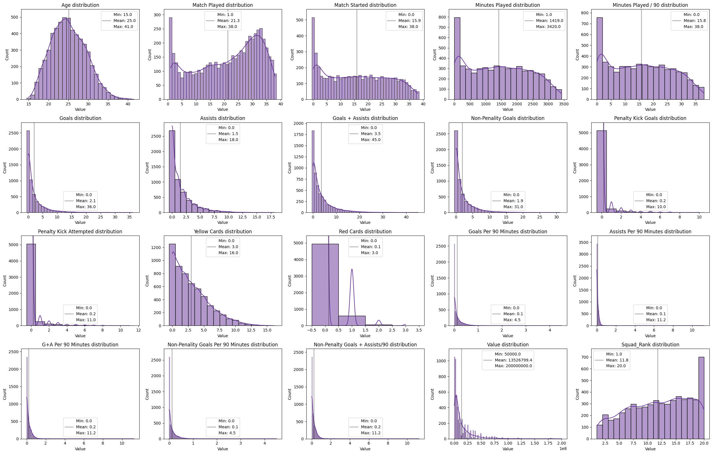
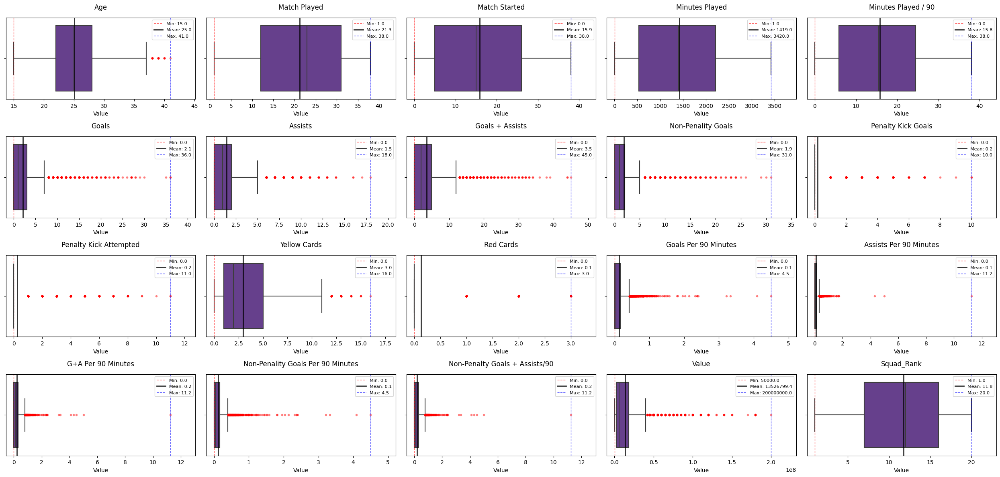
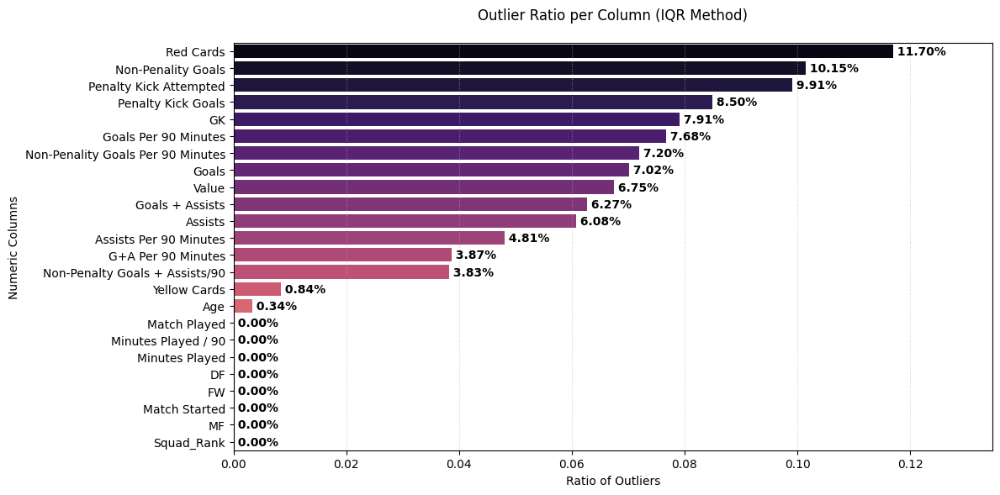

# MarketValuePrediction

## Objective

To create a model that predicts a player’s market value based on their performance stats and generate insights on which features have the greatest influence.

## Data Collection

1. **Performance Stat**: Used Selenium and BeautifulSoup for collecting data from [fbref.com](http://fbref.com).
   - Created an algorithm that finds links that contain table with performance stats for players in the Big 5 League in Europe
   - Entered destination link using Selenium and extracted HTML.
   - Used BeautifulSoup to extract table from the HTML.
2. **Market Value**: Used Request and BeautifulSoup for collecting data from [transfermarkt.com](http://transfermarkt.com)
   - Created an algorithm that finds links that contain market values for players in the Big 5 League in Europe
   - Used Request and BeautifulSoup to extract data from the sites.
3. Concatenated Both Dataset based on player’s name if there is a match.

## Exploratory Data Analysis

### Dataset

**Shape**: `5613 x 23`

| Column Name                          |  type   | description                                           |
| :----------------------------------- | :-----: | :---------------------------------------------------- |
| **Age**                              |  `int`  | Age of the player                                     |
| **Match Played**                     |  `int`  | Total number of matches played in the season          |
| **Match Started**                    |  `int`  | Number of matches in the starting XI                  |
| **Minutes Played**                   |  `int`  | Total minutes played on the pitch                     |
| **Minutes Played / 90**              | `float` | Total minutes played divided by 90                    |
| **Goals**                            |  `int`  | Total number of goals scored                          |
| **Assists**                          |  `int`  | Total number of assists provided                      |
| **Goals + Assists**                  |  `int`  | Total goal contributions (Goals + Assists)            |
| **Non-Penalty Goals**                |  `int`  | Goals scored excluding penalty kicks                  |
| **Penalty Kick Goals**               |  `int`  | Goals scored from penalty kicks                       |
| **Penalty Kick Attempted**           |  `int`  | Total number of penalty kicks taken                   |
| **Yellow Cards**                     |  `int`  | Total number of yellow cards received                 |
| **Red Cards**                        |  `int`  | Total number of red cards received                    |
| **Goals Per 90 Minutes**             | `float` | Average goals scored per 90 minutes                   |
| **Assists Per 90 Minutes**           | `float` | Average assists provided per 90 minutes               |
| **G+A Per 90 Minutes**               | `float` | Average goal contributions per 90 minutes             |
| **Non-Penalty Goals Per 90 Minutes** | `float` | Average non-penalty goals per 90 minutes              |
| **Non-Penalty Goals + Assists/90**   | `float` | Average non-penalty goal contributions per 90 minutes |
| **FW**                               |  `int`  | Binary indicator for Forward position                 |
| **MF**                               |  `int`  | Binary indicator for Midfielder position              |
| **DF**                               |  `int`  | Binary indicator for Defender position                |
| **GK**                               |  `int`  | Binary indicator for Goalkeeper position              |
| **Squad_Rank**                       |  `int`  | Numerical rank of the player within their squad       |
| **Value**                            | `float` | Estimated market value of the player                  |

---

### Cardinality

---

### Position Distribution

### Column Distribution

#### **Skewness & Kurtosis**:

#### **Histogram**:

#### **Boxplot**:

### Outlier Ratio

  

### Analysis

| Column Name                          |       Action Required       |                                          Description                                           |
| :----------------------------------- | :-------------------------: | :--------------------------------------------------------------------------------------------: |
| **Age**                              |              -              |                     Normal distribution, no transformation seems required                      |
| **Match Played**                     |         **Binning**         | Bimodal distribution; Categorize players based on which cluster they belong to (2~3 category)  |
| **Match Started**                    |     **Min-Max Scaling**     |                           High variance with no significant outlier                            |
| **Minutes Played**                   |     **Min-Max Scaling**     |                           High variance with no significant outlier                            |
| **Minutes Played / 90**              | **Min-Max Scaling or Drop** |                    High variance with no significant outlier, but redudant                     |
| **Goals**                            |      **Log Transform**      |                                 Extremely skewed to the right                                  |
| **Assists**                          |      **Log Transform**      |                                 Extremely skewed to the right                                  |
| **Goals + Assists**                  |          **Drop**           |                                Redundant with Goals and Assists                                |
| **Non-Penalty Goals**                |      **Log Transform**      |                                 Extremely skewed to the right                                  |
| **Penalty Kick Goals**               |      **Binarization**       |       Data mostly sparse (0). Maybe can convert it into binary category "Penalty taker"        |
| **Penalty Kick Attempted**           |          **Drop**           |                               Redundant with Penalty Kick Goals                                |
| **Yellow Cards**                     |          **Drop**           |     Players with high 'Match Played' value seems to have high # of Yellow cards; Redundant     |
| **Red Cards**                        |          **Drop**           |      Players with high 'Match Played' value seems to have high # of Red cards; Redundant       |
| **Goals Per 90 Minutes**             |      **Log Transform**      | _**Extremely**_ skewed to the right; Since mostly sparse, better to add 1: $f(x) = \ln(x + 1)$ |
| **Assists Per 90 Minutes**           |      **Log Transform**      | _**Extremely**_ skewed to the right; Since mostly sparse, better to add 1: $f(x) = \ln(x + 1)$ |
| **G+A Per 90 Minutes**               |          **Drop**           |                        Redundant with Goals and Assists per 90 Minutes                         |
| **Non-Penalty Goals Per 90 Minutes** |      **Log Transform**      | _**Extremely**_ skewed to the right; Since mostly sparse, better to add 1: $f(x) = \ln(x + 1)$ |
| **Non-Penalty Goals + Assists/90**   |      **Log Transform**      | _**Extremely**_ skewed to the right; Since mostly sparse, better to add 1: $f(x) = \ln(x + 1)$ |
| **FW**                               |              -              |                                       Already Binarized                                        |
| **MF**                               |              -              |                                       Already Binarized                                        |
| **DF**                               |              -              |                                       Already Binarized                                        |
| **GK**                               |              -              |                                       Already Binarized                                        |
| **Squad_Rank**                       |              -              |                                       Already Binarized                                        |
| **Value**                            |      **Log Transform**      |                                 Extremely skewed to the right                                  |
